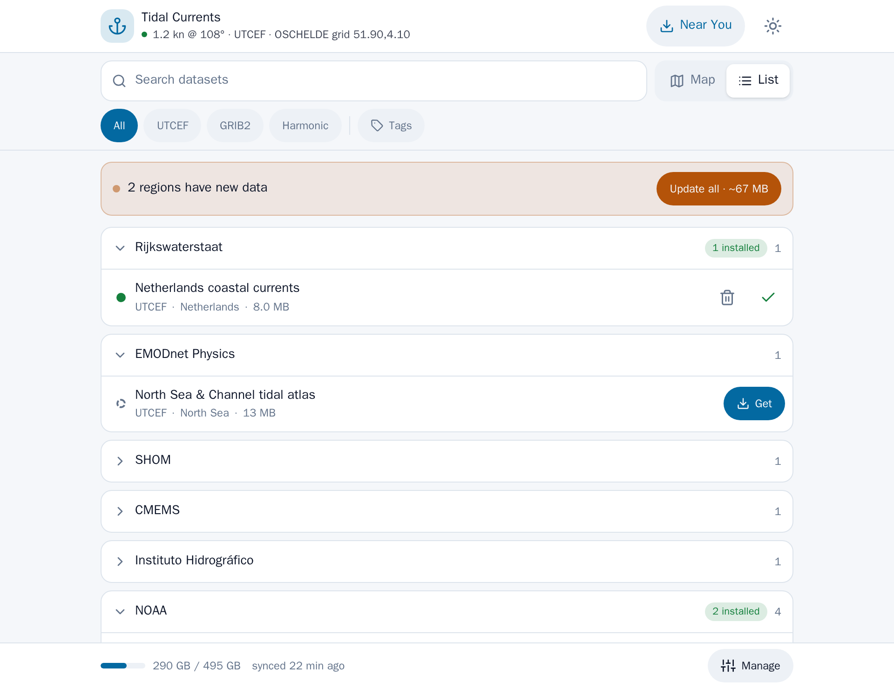
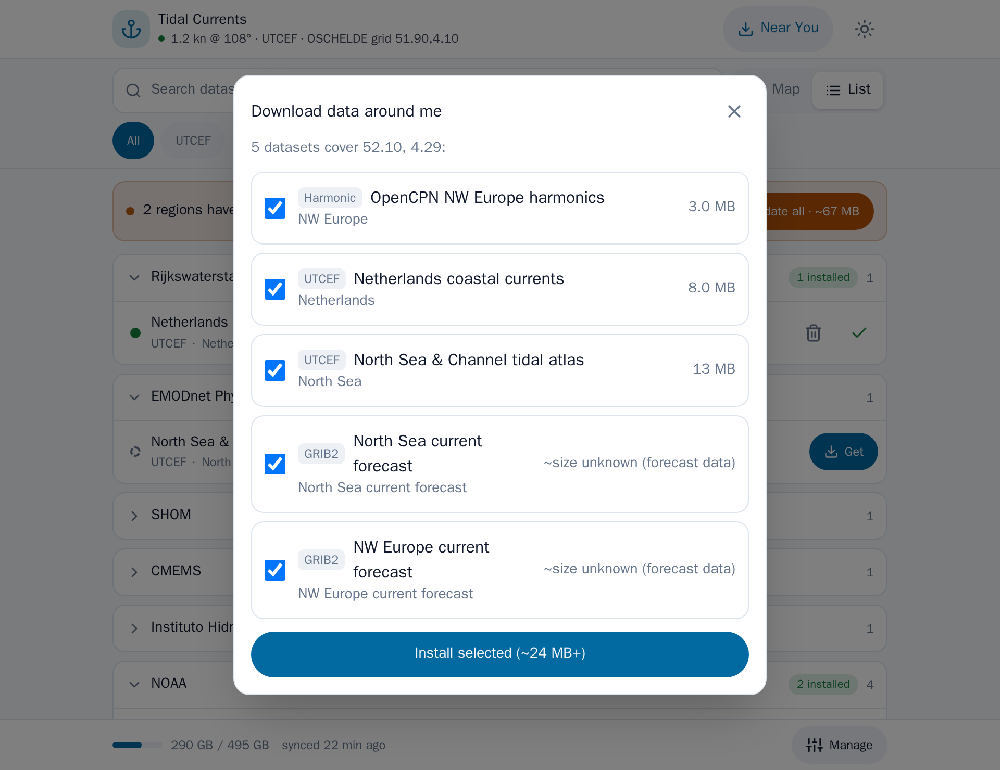
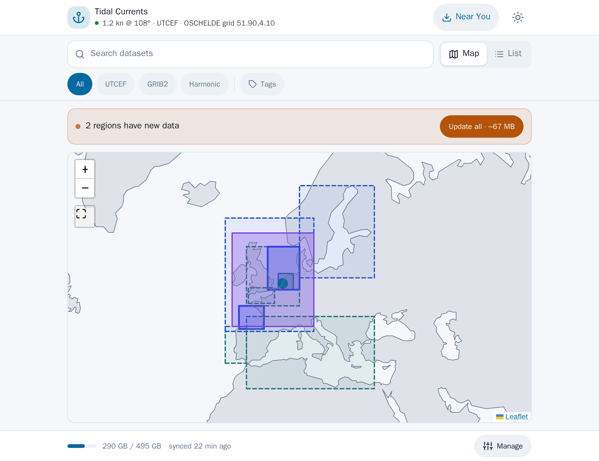

# signalk-tidal-currents

A [Signal K](https://signalk.org) server plugin that predicts **tidal currents**
(set & drift) from three kinds of sources:

- **GRIB2 files** with gridded current fields (u/v velocity components from
  ocean/tidal models) — positional lookups with bilinear interpolation in
  space and linear interpolation in time; no stations involved, and
- **UTCEF datasets** (`*.utcef` / `*.utcef.gz`) — a modern JSON/GeoJSON
  tidal-exchange format carrying full 2D harmonic current constituents per
  station, so every station yields a real set/drift vector.
- OpenCPN/XTide legacy ASCII harmonic files — the `HARMONIC` +
  `HARMONIC.IDX` pair used by OpenCPN and the classic DOS tide programs
  (station-based harmonic prediction),

Unlike tide-height plugins (e.g. the excellent
[signalk-tides](https://github.com/bkeepers/signalk-tides)), this plugin is
about **water movement**: how fast the tidal stream runs and which way it
sets — at a station or anywhere a forecast grid covers, at any time.
Typical uses: passage planning around tidal gates, current-aware routing
(e.g. [signalk-routeiq](https://github.com/marcelrv/signalk-routeiq)),
and showing predicted set/drift on instruments.

## Tidal Currents Manager (bundled webapp)

The plugin ships a responsive, offline-first **Tidal Currents Manager**
webapp (Signal K Admin UI → Webapps) for discovering, downloading and
prioritising tidal-current datasets for your area — no manual file hunting.
All downloads run server-side and the bundled vector coastline map needs no
internet, so it keeps working underway once your data is aboard.

| Browse the catalog | Download for your area | Coverage map |
| --- | --- | --- |
|  |  |  |

One-tap "Near You" downloads for the vessel's position, install/update
status at a glance, disk-usage checks, per-dataset priority, and an offline
vector coastline map — all touch-friendly for use at the helm, with Day,
Dark and Red night themes.

## Features

- Parses OpenCPN/XTide **ASCII harmonic files** (`HARMONIC` +
  `HARMONIC.IDX`), including current reference stations (harmonic
  constituents in knots) and subordinate current stations (flood/ebb time
  offsets, multipliers and **flood/ebb directions**).
- Robust against real-world community files (ragged records, `x`
  placeholders, backtick minus signs, ISO-8859-1 accents).
- Parses **GRIB2 current fields** with a built-in dependency-free decoder
  (regular lat/lon grids; simple and complex packing incl. spatial
  differencing; bitmaps for land masking). Accepts u/v component fields
  (the common encoding) and direction/speed fields. New files dropped into
  the GRIB directory are picked up automatically — no restart needed.
- Parses **UTCEF datasets** (`*.utcef`, or gzip-compressed `*.utcef.gz`)
  with a built-in **dependency-free astronomical engine** (constituent
  speeds, Greenwich equilibrium arguments and Schureman/Foreman nodal
  corrections) — UTCEF, unlike the legacy files, ships only amplitude and
  phase and expects the engine to derive the rest. Implements the
  `harmonic_constituents_currents` method (full 2D u/v vectors, always
  direction-capable). New files dropped into the UTCEF directory are picked
  up automatically — no restart needed.
- **Source selection**: when several sources cover a position, the GRIB
  forecast wins by default, then UTCEF vector stations, then the legacy
  harmonic stations; a source is the fallback outside another's coverage or
  time range. Configurable by source *type* or, from the Manager webapp, as
  a **per-dataset priority stack** (a small high-res dataset can outrank a
  global one where they overlap). The harmonics-only limitation that
  reference stations carry **no direction** does not apply to GRIB or UTCEF
  data — both are always vector-capable.
- **Signal K v1 data model**: publishes `environment.current`
  (`setTrue` rad / `drift` m/s) predicted at the vessel position.
- **v2-style REST API** at `/signalk/v2/api/currents` (also mirrored at the
  v1 plugin path `/plugins/signalk-tidal-currents`): station search by
  position, station and **position timelines**, point vector lookup.
  OpenAPI spec included (Admin UI → Documentation → OpenAPI).

## Which Signal K API — v1 or v2?

Both, deliberately:

- **v1** is the Signal K *data model* (full/delta). It is still the standard
  way to publish live values — every instrument and app understands
  `environment.current`, so predictions are published there as deltas.
- **v2** is the newer family of *domain REST APIs* (`/signalk/v2/api/…`)
  for request/response data. Station metadata and timelines don't belong in
  the vessel data model, so they are served REST-style under
  `/signalk/v2/api/currents`, following the same convention as
  signalk-tides (`/signalk/v2/api/tides`).

## Data files

**The recommended way is the bundled Tidal Currents Manager webapp**
(Signal K Admin UI → Webapps): it browses the tide/current catalog and
downloads UTCEF, GRIB2, and harmonic datasets for your area with one tap —
including storage checks, update detection, and per-dataset priorities, all
into a single Data Directory automatically. For most users that's the whole
story; the rest of this section is for advanced or offline setups.

The plugin reads **one Data Directory** (`<server config dir>/plugin-config-data/
signalk-tidal-currents/` by default — Signal K's standard per-plugin storage
location), searched recursively for:

- a `HARMONIC` + `HARMONIC.IDX` pair (anywhere in the tree — not just the top level),
- GRIB2 current files (see below),
- UTCEF (`*.utcef` / `*.utcef.gz`) datasets.

The Manager webapp organizes its own downloads into `harmonic/`, `grib/`,
`utcef/` subfolders under the Data Directory (GRIB2 and UTCEF further split
into a subfolder per region) purely for browsability — that layout is not
required by anything that reads the data. Files dropped in by hand are
picked up automatically within a minute, no restart needed, **in any folder
structure you like**: flat at the top level, mirrored from an existing
OpenCPN `tcdata` folder (copy or symlink it in), or organized however makes
sense to you.

### Getting harmonic files manually (fallback)

- **OpenCPN installations** ship a `tcdata` folder. Note: the files bundled
  with current OpenCPN releases contain current stations **for the Americas
  only** (from NOAA/XTide) — the bundled European data (TICON) is
  heights-only. Typical locations if OpenCPN is already installed:
  - **Linux:** `/usr/share/opencpn/tcdata/` (or
    `/usr/local/share/opencpn/tcdata/` for from-source installs)
  - **macOS:** `/Applications/OpenCPN.app/Contents/SharedSupport/tcdata/`
  - **Windows:** `C:\Program Files (x86)\OpenCPN\tcdata\`

  (Exact paths vary by OpenCPN version/packaging — check the install
  directory if not found.) Without installing OpenCPN, the same
  `HARMONICS_NO_US` + `.IDX` pair can be fetched directly from the
  [OpenCPN GitHub repository](https://github.com/OpenCPN/OpenCPN/tree/master/data/tcdata),
  or grab the full app from [opencpn.org](https://opencpn.org/) (its
  installer bundles `tcdata`).
- **Community harmonic bundles** (e.g. the French "HARMONICS V10" set
  circulating among cruisers) add ~150 current stations in W-Europe,
  including dense coverage of the Dutch Waddenzee and the Channel coast.
  These circulate informally on cruising/OpenCPN forums rather than a
  single canonical URL — search for "HARMONICS V10" or ask in the OpenCPN
  community.

### GRIB2 current files

Drop GRIB2 files (`*.grb2`, `*.grib2`, `*.grb`, `*.grib`) containing
current fields anywhere under the Data Directory (plugin config →
*Data Directory*). It's re-scanned about once a minute, so downloading a
fresh forecast file in takes effect without a restart.

What the plugin looks for inside the files:

- **Ocean-current fields**: GRIB2 discipline 10 (oceanographic products),
  category 1 (currents) — either u/v components (parameters 2/3, the usual
  encoding) or direction/speed (parameters 0/1).
- **Surface level** (or depth-below-sea-level; the shallowest level wins).
- Regular latitude/longitude grids, simple or complex packing (with or
  without spatial differencing) — what the common sources produce.
  JPEG2000-packed files (some NOAA products) are not supported; most GRIB
  delivery services (Saildocs, XyGrib, qtVlm, Expedition) provide
  currents in the supported packings.

Typical sources of current GRIBs: Saildocs (`RTOFS` requests), XyGrib/
openSkiron, qtVlm's download service, national met/hydrographic services,
or commercial weather routing providers.

> ⚠️ **Disclaimer**: community harmonic data is not official hydrographic
> data. Subordinate
> station predictions use the classic offset/multiplier approximation, and
> GRIB currents are model forecasts with their own errors.
> Treat all output as estimates — never as your sole source for navigation.

## REST API

Base: `/signalk/v2/api/currents` (same routes at
`/plugins/signalk-tidal-currents`).

| Endpoint | Description |
| --- | --- |
| `GET /` | Dataset summary across all three sources (harmonic + UTCEF stations, GRIB coverage/time range) |
| `GET /stations?latitude=&longitude=&limit=` | Nearest current stations (harmonic + UTCEF), closest first |
| `GET /stations?bbox=w,s,e,n&maxPoints=` | Every current station in a map viewport, thinned to `maxPoints` (stable across pan/zoom) |
| `GET /stations/{id}` | Station metadata (harmonic or UTCEF) incl. flood/ebb directions and offsets |
| `GET /stations/{id}/timeline?start=&end=&step=` | Set/drift series for one station (default 24 h, 10-min step) |
| `GET /timeline?latitude=&longitude=&start=&end=&step=` | Set/drift series at a **position** — per-sample source selection (GRIB / UTCEF / station) |
| `GET /vector?latitude=&longitude=&time=` | Set/drift vector at a position (GRIB → UTCEF → station, configurable) |
| `GET /grid?bbox=w,s,e,n&time=&maxPoints=` | GRIB current vectors sampled over a viewport for a flow-field overlay, thinned to `maxPoints` |

**Stations vs positions**: harmonic and UTCEF data are station-based; GRIB
data is gridded and has no stations, so GRIB-backed lookups are purely
positional (`/vector`, `/timeline`, `/grid`). `/vector` and `/timeline`
report which source produced each answer (`source` field; per-sample in
`/timeline`, so a window extending past the GRIB forecast horizon degrades
to the other sources sample-by-sample rather than failing).

**Viewport queries** (`/stations?bbox=` and `/grid?bbox=`) return a whole
map viewport's worth of coverage rather than a fixed nearest-N list. Both
accept `maxPoints` to cap how many points come back, thinned on a stable
spatial grid so a zoomed-out view (e.g. all of Europe, with hundreds of
thousands of stations) stays responsive, and panning or zooming doesn't
reshuffle which points appear. Ask for more (or a smaller box) to get full
detail when zoomed in.

**"Vector-capable" stations**: reference current stations in the XTide ASCII
format only carry a signed speed (harmonic constituents in knots) — they're
typically sited in a narrow channel where flow is bidirectional along an
axis that the file format never records. Subordinate current stations, by
contrast, carry explicit flood/ebb direction headings (degrees true) in
their `^` offset line, which is what lets the plugin resolve them into a
true set/drift vector (`direction`, `u`, `v`). Reference stations are
therefore skipped by `/vector` and by `environment.current` publishing
(`vectorCapable: false` in `/stations`), even though their raw signed speed
is still available via `/stations/{id}/timeline`.

`GET /stations?latitude=52.0&longitude=4.7&limit=3` (harmonic and UTCEF
stations are merged and sorted by distance):

```json
[
  {
    "id": "OSCHELDE_51p900_4p100",
    "name": "OSCHELDE grid 51.900,4.100",
    "latitude": 51.9,
    "longitude": 4.1,
    "type": "harmonic",
    "source": "utcef",
    "constituents": 8,
    "vectorCapable": true,
    "distanceKm": 42.7
  },
  {
    "id": "texel-noorderhaaks",
    "name": "Texel, Noorderhaaks",
    "latitude": 53.0092,
    "longitude": 4.6967,
    "type": "subordinate",
    "referenceName": "Texel Reference",
    "floodDir": 112,
    "ebbDir": 292,
    "distanceKm": 122.4,
    "vectorCapable": true
  },
  {
    "id": "texel-reference",
    "name": "Texel Reference",
    "latitude": 53.0,
    "longitude": 4.75,
    "type": "reference",
    "referenceName": null,
    "floodDir": null,
    "ebbDir": null,
    "distanceKm": 123.1,
    "vectorCapable": false
  }
]
```

The first entry is a **UTCEF** station: `source: "utcef"`, always
`vectorCapable` (full 2D harmonic constituents), and identified by
`type: "harmonic"` with a `constituents` count rather than the XTide
`reference`/`subordinate` distinction. The two Texel entries are
legacy XTide harmonic stations.

`GET /vector?latitude=52.0&longitude=4.7` (station fallback; with GRIB
coverage `source` is `"grib"` and `station` is `null`):

```json
{
  "source": "station",
  "station": {
    "id": "texel-noorderhaaks",
    "name": "Texel, Noorderhaaks",
    "latitude": 53.0092,
    "longitude": 4.6967,
    "type": "subordinate",
    "referenceName": "Texel Reference",
    "floodDir": 112,
    "ebbDir": 292,
    "distanceKm": 122.4
  },
  "sample": {
    "time": "2026-07-02T12:30:00.000Z",
    "speedKn": 3.03,
    "direction": 345,
    "u": -0.404,
    "v": 1.506
  }
}
```

Timeline sample entry:

```json
{
  "time": "2026-07-02T12:30:00.000Z",
  "speedKn": 3.03,        // signed along-axis speed, + = flood
  "direction": 345,       // degrees true
  "u": -0.404,            // m/s east component
  "v": 1.506              // m/s north component
}
```

Note on `speedKn`: for **station** samples it is signed along the
flood/ebb axis (+ = flood); for **GRIB** samples there is no flood/ebb
axis, so it is simply the current's magnitude (`direction`/`u`/`v` carry
the vector either way).

## Plugin configuration

Most users won't touch these — the Tidal Currents Manager webapp handles
data and priorities. The form exists for advanced/headless setups.

| Setting | Default | Description |
| --- | --- | --- |
| Data Directory | `<plugin data dir>` | Searched recursively for a `HARMONIC` + `HARMONIC.IDX` pair, GRIB2 files (see [GRIB2 current files](#grib2-current-files)), and UTCEF datasets — any folder structure underneath it works |
| Prefer GRIB over stations | `true` | Use the GRIB forecast when both cover a position (legacy — superseded by Source Priority when set) |
| Source Priority | `grib2, utcef, harmonic` | Order to try the three source *types*; the webapp's reorder list is the primary way to change this |
| Publish environment.current | `true` | Emit deltas at the vessel position |
| Delta Update Period | `60 s` | How often to re-predict |
| Max Station Distance | `15 km` | Don't publish from a station when none is nearby (GRIB coverage is not distance-limited) |
| Tide/Current Catalog URL | signalk-router-data index | Catalog the webapp downloads datasets from; cached locally for offline use |
| Catalog Refresh Interval | `24 h` | How often to re-fetch the catalog (a failed refresh keeps the cached copy) |
| Auto-Update Check Interval | `30 min` | How often to re-download datasets you've marked "keep fresh when online" |

`<plugin data dir>` is Signal K's standard per-plugin storage location:
`<server config dir>/plugin-config-data/signalk-tidal-currents`.

Beyond the source-*type* order above, the webapp also supports a
**per-dataset priority stack** (e.g. a small high-resolution coastal model
winning over a global one where they overlap) — set and persisted from the
Manager's *Manage → Data priority* panel.

## Roadmap

- **XTide `.tcd` (libtcd) support** — the bit-packed binary format used for
  the NOAA/US data. The format is public domain with a written spec, but no
  maintained JS decoder exists yet; this needs a port of libtcd's
  bit-unpacking.
- GRIB2 JPEG2000 (template 5.40) packing — needs a JS JPEG2000 codec.
- Interpolation between stations; harmonic subordinate handling refinements.
- Growing the tide/current catalog (more regions/providers) the Manager
  downloads from — maintained in
  [signalk-router-data](https://github.com/marcelrv/signalk-router-data).

## Development

```bash
npm install
npm test   # builds and runs the node:test suite (no extra tooling needed)
```

CI runs the shared
[SignalK plugin-ci workflow](https://github.com/SignalK/signalk-server/blob/master/.github/workflows/plugin-ci.yml)
across Linux (x64/arm64), macOS and Windows; the results appear on the
plugin's App Store *Indicators* tab.

## Acknowledgements & licensing

- File-format knowledge derives from the classic
  [XTide](https://flaterco.com/xtide/) ASCII harmonics format and OpenCPN's
  documentation of it. The parser here is an independent reimplementation
  (OpenCPN's own parser is GPLv2 and was used as a *format reference only*).
- The GRIB2 decoder is likewise an independent implementation from the WMO
  FM 92 specification and NCEP's public template documentation (no code
  from wgrib2/g2c/eccodes); it was validated against eccodes output on
  real NCEP files.
- This plugin is licensed under the **Apache License 2.0**. Source files
  carry SPDX headers.
- Harmonic data files are **not** included — their licenses/provenance vary;
  bring your own. (The integration tests download OpenCPN's
  `HARMONICS_NO_US` pair into a local cache on demand for the same reason:
  those files carry no explicit standalone license, so they cannot be
  redistributed inside this Apache-2.0 project.)
